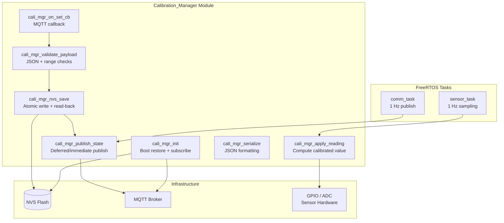
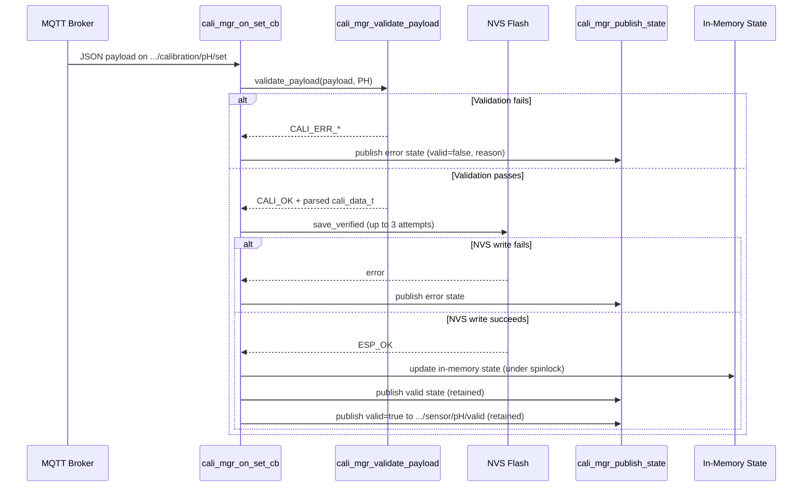
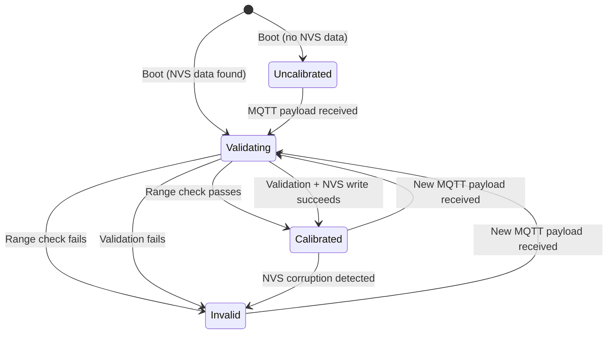

# Design Document: Calibration Scheme

## Overview

This design describes the **Calibration_Manager** module — a refactoring of the existing `sensor_telemetry.c` calibration logic into a cohesive, independently testable subsystem. The module owns the full calibration lifecycle for per-zone, per-sensor-type (pH and TDS) linear calibration data on an ESP32 FreeRTOS system.

The Calibration_Manager is responsible for:
- Boot-time restoration of calibration from NVS with plausible-range validation
- MQTT subscription to calibration command topics with reconnection/retry
- Incoming payload validation (JSON parsing, field presence, range checks, mode check)
- Atomic NVS persistence with read-back verification
- Post-calibration state publication (retained MQTT messages)
- Calibrated value computation with physical range gating
- Raw sensor reading publication (unconditional, every cycle)
- NVS corruption detection and reporting
- Sensor-type independence (no shared mutable state between pH and TDS)
- Well-defined JSON serialization (4 decimal places, 256-byte limit, round-trip fidelity)

### Design Rationale

The current implementation scatters calibration concerns across `sensor_telemetry.c`, `sensor_calibration_nvs.c`, and `runtime_tasks.c` (comm_task). This redesign consolidates all calibration logic into a single module with a clean public API, enabling:
1. Unit-testable pure functions (validation, computation, serialization) separated from I/O
2. Explicit error reporting via MQTT with structured reason fields
3. Retry logic for NVS writes and MQTT subscriptions
4. Read-back verification for NVS integrity
5. Deferred publication when MQTT is not yet connected at boot

## Architecture



### Task Integration

The Calibration_Manager does **not** create its own FreeRTOS task. It operates within the existing task architecture:

| Task | Interaction with Calibration_Manager |
|------|--------------------------------------|
| `sensor_task` | Calls `cali_mgr_apply_reading()` at 1 Hz to compute calibrated values |
| `comm_task` | Calls `cali_mgr_get_publish_data()` to obtain raw/state/valid values for MQTT publication |
| MQTT event loop | Dispatches inbound calibration payloads to `cali_mgr_on_set_cb()` via `mqtt_manager_subscribe` callback |
| `app_main` / `runtime_tasks_start` | Calls `cali_mgr_init()` during system startup |

### Concurrency Model

- **portMUX spinlock** (`s_cali_lock`): Protects per-sensor calibration state reads/writes between the MQTT callback context and the sensor_task sampling context. Critical sections are kept minimal (struct copy only).
- **No FreeRTOS mutex needed**: All calibration state access is a fixed-size struct copy under a spinlock — no blocking I/O inside the critical section.
- **NVS operations**: Performed outside the spinlock in the MQTT callback context (which runs on the MQTT event task). NVS has its own internal locking.
- **Deferred publish queue**: A small flag-based mechanism (not a FreeRTOS queue) tracks whether boot-time state publication is pending, checked by `comm_task` on each cycle.

## Components and Interfaces

### Module: `calibration_manager` (new)

**Files:** `main/calibration_manager.h`, `main/calibration_manager.c`

#### Public API

```c
#ifndef CALIBRATION_MANAGER_H
#define CALIBRATION_MANAGER_H

#include <stdbool.h>
#include <stdint.h>
#include "esp_err.h"

/* Sensor types managed by the calibration system */
typedef enum {
    CALI_SENSOR_PH = 0,
    CALI_SENSOR_TDS,
    CALI_SENSOR_COUNT
} cali_sensor_type_t;

/* Calibration data record */
typedef struct {
    char     mode[16];      /* "linear" */
    float    slope;
    float    offset;
    bool     valid;
    uint32_t updated_at;    /* Unix timestamp */
} cali_data_t;

/* Validation failure reason codes */
typedef enum {
    CALI_OK = 0,
    CALI_ERR_JSON_PARSE,
    CALI_ERR_MISSING_FIELD,
    CALI_ERR_INVALID_MODE,
    CALI_ERR_NON_FINITE,
    CALI_ERR_ZERO_SLOPE,
    CALI_ERR_SLOPE_RANGE,
    CALI_ERR_OFFSET_RANGE,
    CALI_ERR_NVS_WRITE,
    CALI_ERR_NVS_READ,
    CALI_ERR_NVS_VERIFY,
    CALI_ERR_SUBSCRIBE,
} cali_error_t;

/* Result of applying calibration to a raw reading */
typedef struct {
    uint16_t raw;           /* Raw sensor value (GPIO level or ADC counts) */
    float    calibrated;    /* Computed physical value */
    bool     valid;         /* true if calibration applied and in range */
    bool     raw_ok;        /* true if hardware read succeeded */
} cali_reading_t;

/**
 * @brief  Initialize the Calibration_Manager for a zone.
 *
 * Loads calibration from NVS, validates plausible ranges, subscribes to
 * MQTT calibration topics, and queues deferred state publication.
 *
 * @param zone_id  NUL-terminated zone identifier (e.g. "zone_1")
 * @return ESP_OK on success
 */
esp_err_t cali_mgr_init(const char *zone_id);

/**
 * @brief  Deinitialize and release resources.
 */
esp_err_t cali_mgr_deinit(void);

/**
 * @brief  Notify the manager that MQTT is now connected.
 *
 * Triggers deferred state publication and re-subscription.
 */
void cali_mgr_on_mqtt_connected(void);

/**
 * @brief  Apply calibration to a raw sensor reading.
 *
 * @param type      Sensor type (pH or TDS)
 * @param raw_value Raw reading from hardware (GPIO level or ADC counts)
 * @param raw_ok    Whether the hardware read succeeded
 * @return cali_reading_t with computed values and validity
 */
cali_reading_t cali_mgr_apply_reading(cali_sensor_type_t type,
                                       uint16_t raw_value, bool raw_ok);

/**
 * @brief  Get the current calibration data for a sensor type.
 *
 * @param type  Sensor type
 * @param out   Output calibration data
 */
void cali_mgr_get_calibration(cali_sensor_type_t type, cali_data_t *out);

/**
 * @brief  Check if a sensor type has valid calibration loaded.
 */
bool cali_mgr_is_valid(cali_sensor_type_t type);

/**
 * @brief  Publish raw/state/valid for a sensor reading cycle.
 *
 * Called by comm_task. Publishes raw always, state only if valid,
 * valid as retained.
 *
 * @param type    Sensor type
 * @param reading Result from cali_mgr_apply_reading()
 */
void cali_mgr_publish_reading(cali_sensor_type_t type,
                               const cali_reading_t *reading);

/**
 * @brief  Publish any deferred calibration state (called by comm_task).
 *
 * Checks if boot-time or post-update state publication is pending
 * and publishes if MQTT is connected.
 */
void cali_mgr_publish_deferred(void);

/* ── Pure functions (testable without hardware) ─────────────────────────── */

/**
 * @brief  Validate a calibration JSON payload.
 *
 * @param payload      Raw JSON bytes
 * @param payload_len  Length of payload
 * @param type         Target sensor type (for range checks)
 * @param out          Parsed calibration data (valid only if CALI_OK returned)
 * @return CALI_OK or specific error code
 */
cali_error_t cali_mgr_validate_payload(const char *payload, int payload_len,
                                        cali_sensor_type_t type,
                                        cali_data_t *out);

/**
 * @brief  Compute calibrated value from raw reading.
 *
 * @param cali      Calibration coefficients
 * @param raw       Raw sensor value
 * @param val_min   Minimum valid physical value
 * @param val_max   Maximum valid physical value
 * @param out_value Computed value (only valid if return is true)
 * @return true if computation succeeded and value is in range
 */
bool cali_mgr_compute(const cali_data_t *cali, uint16_t raw,
                       float val_min, float val_max, float *out_value);

/**
 * @brief  Serialize calibration state to JSON.
 *
 * @param cali   Calibration data to serialize
 * @param reason Error reason string (NULL for valid states)
 * @param buf    Output buffer
 * @param buf_len Buffer size (must be >= 256)
 * @return Number of bytes written, or -1 on error
 */
int cali_mgr_serialize(const cali_data_t *cali, const char *reason,
                        char *buf, size_t buf_len);

/**
 * @brief  Deserialize JSON back to calibration data.
 *
 * @param json      NUL-terminated JSON string
 * @param json_len  Length of JSON
 * @param out       Output calibration data
 * @return true on successful parse
 */
bool cali_mgr_deserialize(const char *json, int json_len, cali_data_t *out);

#endif /* CALIBRATION_MANAGER_H */
```

### Module: `sensor_calibration_nvs` (refactored)

The existing NVS module is extended with:
- **Atomic write**: All fields committed together via `nvs_commit()` (already implemented)
- **Read-back verification**: New function `sensor_calibration_nvs_save_verified()` that writes, then reads back and compares slope/offset
- **Retry logic**: Caller (Calibration_Manager) retries up to 2 additional times on failure

```c
/* New additions to sensor_calibration_nvs.h */

/**
 * @brief  Save calibration with read-back verification.
 *
 * Writes all fields atomically, then reads back slope and offset
 * to verify integrity.
 *
 * @param type   Sensor type (pH or TDS)
 * @param c      Calibration data to persist
 * @return ESP_OK on success, ESP_ERR_INVALID_CRC on verify mismatch
 */
esp_err_t sensor_calibration_nvs_save_verified(cali_sensor_type_t type,
                                                const cali_data_t *c);
```

### Module: `sensor_telemetry` (simplified)

After refactoring, `sensor_telemetry.c` retains:
- Hardware initialization (ADC, GPIO)
- Sensor sampling (reading raw values from hardware)
- Rolling average history
- Snapshot management

It **delegates** to `calibration_manager` for:
- Calibration loading/validation
- Calibrated value computation
- MQTT calibration topic subscription
- Calibration state publication

### Interaction Sequence: Calibration Update



## Data Models

### `cali_data_t` — Calibration Record

| Field | Type | Description | Constraints |
|-------|------|-------------|-------------|
| `mode` | `char[16]` | Calibration mode | Only `"linear"` recognized |
| `slope` | `float` | Linear coefficient | pH: [-20.0, 20.0], TDS: [-100.0, 100.0], non-zero |
| `offset` | `float` | Linear offset | pH: [-50.0, 50.0], TDS: [-500.0, 500.0] |
| `valid` | `bool` | Whether calibration is active | |
| `updated_at` | `uint32_t` | Unix timestamp of last update | 0 if never calibrated |

### NVS Storage Layout

**Namespace:** `"sensor_cali"` (unchanged from current implementation)

| Key | Type | Sensor | Description |
|-----|------|--------|-------------|
| `ph_slope` | `u32` (IEEE-754 bits) | pH | Slope coefficient |
| `ph_offset` | `u32` (IEEE-754 bits) | pH | Offset coefficient |
| `ph_valid` | `u8` | pH | Valid flag (0 or 1) |
| `ph_upd_at` | `u32` | pH | Unix timestamp |
| `tds_slope` | `u32` (IEEE-754 bits) | TDS | Slope coefficient |
| `tds_offset` | `u32` (IEEE-754 bits) | TDS | Offset coefficient |
| `tds_valid` | `u8` | TDS | Valid flag (0 or 1) |
| `tds_upd_at` | `u32` | TDS | Unix timestamp |

### MQTT Topic Map

| Topic Pattern | Direction | QoS | Retain | Payload |
|---------------|-----------|-----|--------|---------|
| `<zone>/sensor/<type>/raw` | Publish | 0 | No | Decimal integer string (e.g. `"1"`, `"2847"`) |
| `<zone>/sensor/<type>/state` | Publish | 0 | No | Float string (e.g. `"7.0200"`) |
| `<zone>/sensor/<type>/valid` | Publish | 0 | Yes | `"true"` or `"false"` |
| `<zone>/calibration/<type>/state` | Publish | 1 | Yes | JSON (see serialization format) |
| `<zone>/calibration/<type>/set` | Subscribe | 1 | — | JSON calibration payload |

### Plausible Range Constants

```c
/* pH sensor */
#define CALI_PH_SLOPE_MIN    (-20.0f)
#define CALI_PH_SLOPE_MAX    ( 20.0f)
#define CALI_PH_OFFSET_MIN   (-50.0f)
#define CALI_PH_OFFSET_MAX   ( 50.0f)
#define CALI_PH_VALUE_MIN    (  0.0f)
#define CALI_PH_VALUE_MAX    ( 14.0f)

/* TDS sensor */
#define CALI_TDS_SLOPE_MIN   (-100.0f)
#define CALI_TDS_SLOPE_MAX   ( 100.0f)
#define CALI_TDS_OFFSET_MIN  (-500.0f)
#define CALI_TDS_OFFSET_MAX  ( 500.0f)
#define CALI_TDS_VALUE_MIN   (   0.0f)
#define CALI_TDS_VALUE_MAX   (5000.0f)
```

### JSON Serialization Format

**Valid state:**
```json
{"mode":"linear","slope":-5.7200,"offset":21.3400,"valid":true,"updated_at":1746950000}
```

**Invalid/error state:**
```json
{"mode":"linear","slope":0.0000,"offset":0.0000,"valid":false,"updated_at":0,"reason":"slope out of range for pH"}
```

**Constraints:**
- Total payload ≤ 256 bytes
- Slope and offset formatted to exactly 4 decimal places
- `reason` field: max 128 characters, present only in error states
- Field order is fixed (mode, slope, offset, valid, updated_at, [reason])

### Per-Sensor State Machine



| State | Raw Published | State Published | Valid Published |
|-------|---------------|-----------------|-----------------|
| Uncalibrated | Yes | No (suppressed) | `"false"` (retained) |
| Calibrated | Yes | Yes (calibrated value) | `"true"` (retained) |
| Invalid | Yes | No (suppressed) | `"false"` (retained) |

## Correctness Properties

*A property is a characteristic or behavior that should hold true across all valid executions of a system — essentially, a formal statement about what the system should do. Properties serve as the bridge between human-readable specifications and machine-verifiable correctness guarantees.*

### Property 1: Range validation accepts only in-range coefficients

*For any* slope and offset value pair and any sensor type (pH or TDS), the range validation function SHALL accept the pair if and only if slope is within the sensor type's plausible slope range and offset is within the sensor type's plausible offset range (pH: slope ∈ [-20.0, 20.0], offset ∈ [-50.0, 50.0]; TDS: slope ∈ [-100.0, 100.0], offset ∈ [-500.0, 500.0]).

**Validates: Requirements 1.7, 4.5, 4.6**

### Property 2: Invalid payloads are always rejected

*For any* byte string that is not valid JSON, or any JSON object missing one or more of the required fields (mode, slope, offset), or any payload where slope or offset is non-finite (NaN/Infinity), or any payload where slope is zero, or any payload where mode is not `"linear"`, the validation function SHALL return a non-OK error code and SHALL NOT produce a valid `cali_data_t` output.

**Validates: Requirements 4.1, 4.2, 4.3, 4.4**

### Property 3: Validation stops at first failure

*For any* calibration payload containing multiple validation errors, the error code returned by the validation function SHALL correspond to the first check that fails in the defined validation order: (1) JSON parse, (2) field presence, (3) finite/non-zero, (4) mode check, (5) range check.

**Validates: Requirements 4.7**

### Property 4: Failed validation never triggers NVS write

*For any* calibration payload that fails validation (any error code ≠ CALI_OK), the system SHALL NOT invoke any NVS write operation, and the existing in-memory calibration state SHALL remain unchanged.

**Validates: Requirements 4.8**

### Property 5: Linear computation correctness

*For any* valid calibration data (mode="linear", valid=true) and any raw sensor value, the computed calibrated value SHALL equal `(raw × slope) + offset`, computed using IEEE-754 single-precision floating-point arithmetic.

**Validates: Requirements 7.1**

### Property 6: State publication gated on validity and range

*For any* sensor type, raw reading, and calibration state: the calibrated state value SHALL be published if and only if (a) the calibration is marked valid, AND (b) the computed value is finite, AND (c) the computed value falls within the sensor type's physical range (pH: [0.0, 14.0], TDS: [0.0, 5000.0]).

**Validates: Requirements 7.2, 7.3, 7.4**

### Property 7: Raw reading always published

*For any* calibration state (valid, invalid, missing, or corrupted NVS) and any successful hardware read, the raw sensor value SHALL be published to the raw topic on every reading cycle.

**Validates: Requirements 2.2, 8.3**

### Property 8: Sensor type independence

*For any* sequence of calibration operations (update, invalidation, NVS failure) applied to one sensor type, the other sensor type's in-memory calibration data (mode, slope, offset, valid flag, and updated_at) SHALL remain at its prior values, and its calibrated value computation and publication SHALL continue unaffected.

**Validates: Requirements 9.1, 9.2, 9.3, 9.4**

### Property 9: Serialization round-trip fidelity

*For any* valid `cali_data_t` object (valid=true, mode="linear", slope and offset within plausible ranges), serializing to JSON and then deserializing back SHALL produce a `cali_data_t` where slope and offset match the original within ±0.00005, and mode, valid, and updated_at fields match exactly.

**Validates: Requirements 10.5**

### Property 10: Serialization format and size constraints

*For any* `cali_data_t` object (valid or invalid with reason), the serialized JSON output SHALL: (a) not exceed 256 bytes total, (b) format slope and offset to exactly 4 decimal places, (c) include all required fields in the specified order, and (d) include a `reason` field of at most 128 characters when valid is false.

**Validates: Requirements 10.1, 10.2, 10.3, 10.4**

### Property 11: NVS write-then-read-back integrity

*For any* valid calibration data written to NVS, reading back the slope and offset values immediately after a successful write SHALL produce values that are bit-identical to the written values (since they are stored as IEEE-754 uint32 bit patterns).

**Validates: Requirements 8.4**

## Error Handling

### Error Categories and Responses

| Error | Detection | Response | Recovery |
|-------|-----------|----------|----------|
| NVS read failure at boot | `nvs_open`/`nvs_get_*` returns error | Set in-memory invalid, publish valid=false | Wait for MQTT calibration payload |
| NVS data out of range at boot | Range check on loaded slope/offset | Treat as invalid, publish error state with reason | Wait for MQTT calibration payload |
| Invalid JSON payload | `cali_mgr_validate_payload` returns `CALI_ERR_JSON_PARSE` | Publish error to calibration state topic | Discard payload, retain existing calibration |
| Missing fields in payload | Validation returns `CALI_ERR_MISSING_FIELD` | Publish error with reason identifying missing field | Discard payload |
| Out-of-range coefficients | Validation returns `CALI_ERR_SLOPE_RANGE` or `CALI_ERR_OFFSET_RANGE` | Publish error with reason | Discard payload |
| NVS write failure | `nvs_commit` returns error | Retry up to 2 more times, then publish error | Retain previous in-memory calibration |
| NVS read-back mismatch | Post-write verification fails | Treat as corruption, mark invalid, publish error | Wait for new MQTT calibration |
| MQTT subscribe failure | `mqtt_manager_subscribe` returns error | Retry 3 times at 2-second intervals | Publish error if all retries exhausted |
| MQTT publish failure (post-write) | `mqtt_manager_publish` returns error | Retry 3 times at 1-second intervals | Calibration remains applied regardless |
| MQTT not connected at boot | `mqtt_manager_is_connected()` returns false | Defer publication, set pending flag | Publish when `cali_mgr_on_mqtt_connected()` is called |
| Computed value out of physical range | Range check on `raw * slope + offset` | Suppress state publish for that cycle | Continue publishing raw; next cycle may succeed |
| Hardware read failure | GPIO/ADC read returns error | Skip raw and state publish for that cycle | Resume on next successful read |

### Error Reason Strings

The `reason` field in error state JSON uses these standardized strings:

```c
#define CALI_REASON_JSON_PARSE      "JSON parse failed"
#define CALI_REASON_MISSING_MODE    "missing field: mode"
#define CALI_REASON_MISSING_SLOPE   "missing field: slope"
#define CALI_REASON_MISSING_OFFSET  "missing field: offset"
#define CALI_REASON_INVALID_MODE    "unrecognized mode"
#define CALI_REASON_NON_FINITE      "slope or offset is non-finite"
#define CALI_REASON_ZERO_SLOPE      "slope is zero"
#define CALI_REASON_PH_SLOPE_RANGE  "slope out of range for pH [-20,20]"
#define CALI_REASON_PH_OFFSET_RANGE "offset out of range for pH [-50,50]"
#define CALI_REASON_TDS_SLOPE_RANGE "slope out of range for TDS [-100,100]"
#define CALI_REASON_TDS_OFFSET_RANGE "offset out of range for TDS [-500,500]"
#define CALI_REASON_NVS_WRITE       "NVS write failed after retries"
#define CALI_REASON_NVS_VERIFY      "NVS read-back verification failed"
#define CALI_REASON_NVS_READ        "NVS read error at boot"
#define CALI_REASON_NVS_RANGE       "NVS data out of plausible range"
#define CALI_REASON_SUB_FAILED      "MQTT subscription failed after retries"
```

### Retry Policies

| Operation | Max Attempts | Interval | On Exhaustion |
|-----------|-------------|----------|---------------|
| NVS write | 3 (1 + 2 retries) | Immediate | Publish error, retain previous calibration |
| MQTT subscribe | 3 | 2 seconds | Publish error to calibration state |
| MQTT publish (post-write) | 3 | 1 second | Log warning; calibration remains applied |

## Testing Strategy

### Property-Based Testing

The Calibration_Manager's pure functions are well-suited to property-based testing. The following functions have clear input/output behavior with large input spaces:

- `cali_mgr_validate_payload()` — input: arbitrary byte strings / JSON variants; output: error code + parsed data
- `cali_mgr_compute()` — input: calibration coefficients + raw values; output: computed value + validity
- `cali_mgr_serialize()` / `cali_mgr_deserialize()` — input: calibration data; output: JSON string / parsed struct

**Library:** [theft](https://github.com/silentbicycle/theft) (C property-based testing library suitable for embedded/ESP-IDF host tests)

**Configuration:**
- Minimum 100 iterations per property test
- Each test tagged with: `Feature: calibration-scheme, Property N: <property_text>`

**Property tests to implement:**
1. Range validation (Property 1)
2. Invalid payload rejection (Property 2)
3. Validation ordering (Property 3)
4. Linear computation (Property 5)
5. State publication gating (Property 6)
6. Sensor independence (Property 8)
7. Serialization round-trip (Property 9)
8. Serialization format/size (Property 10)

### Unit Tests (Example-Based)

Unit tests cover specific scenarios, edge cases, and integration points:

| Test Category | Examples |
|---------------|----------|
| Boot-time NVS load | Valid data loaded, no data found, read error, out-of-range data |
| MQTT subscription | Successful subscribe, retry on failure, exhausted retries |
| Calibration update flow | Valid payload → NVS write → state publish → in-memory update |
| NVS write failure | Retry behavior, error publication, previous state retained |
| Deferred publication | MQTT not connected at boot, publish on connect |
| Hardware read failure | Skip publish, resume on next success |
| Physical range gating | pH at 0.0, 14.0, -0.1, 14.1; TDS at 0.0, 5000.0, -1.0, 5001.0 |

### Integration Tests

Integration tests verify the full flow on target hardware or QEMU:

1. **Boot-to-publish**: Flash with known NVS data, verify MQTT messages appear
2. **Calibration update end-to-end**: Publish to `/set` topic, verify `/state` response
3. **NVS persistence across reboot**: Set calibration, reboot, verify restored
4. **Reconnection re-subscribe**: Disconnect MQTT, reconnect, verify subscriptions restored

### Test Infrastructure

- **Host-based tests**: Pure functions tested on host (x86) using ESP-IDF's host test framework with `theft` for PBT
- **Target tests**: Integration tests run on ESP32 hardware or QEMU with Unity framework (existing `components/unity_tests/`)
- **Mocking**: NVS and MQTT APIs mocked for unit tests using function pointers or weak symbols

