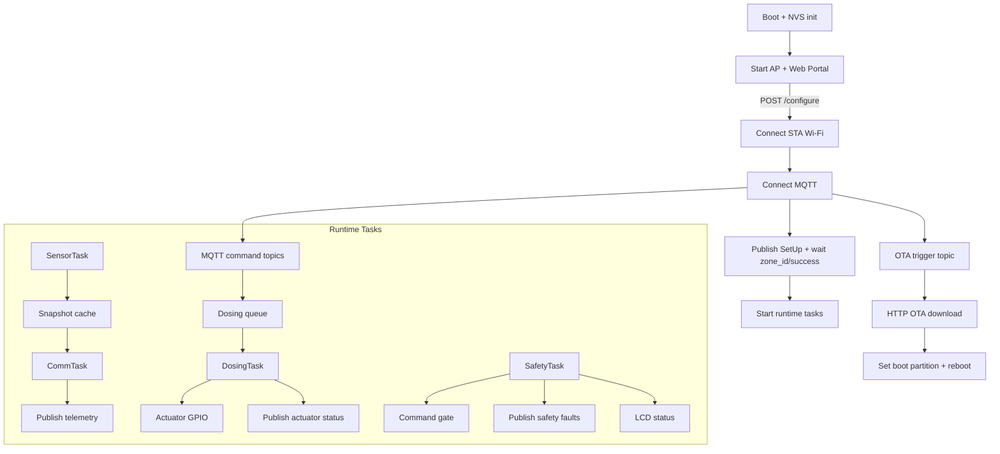

# Website_UpdaterFreeRTOS (ESP32-S3)

Firmware for an ESP32-S3 node that is configured via a local Wi-Fi AP + web portal, then joins a target Wi-Fi network, connects to an MQTT broker, publishes sensor telemetry, accepts actuator commands, and can perform HTTP OTA updates triggered by MQTT.

This README explains the codebase logic, FreeRTOS usage, safety rules, tasks, and data flow to help you modify the firmware safely.

## High-level flow

1. Boot initializes NVS and records boot faults.
2. Device starts a setup AP (soft AP) and HTTP portal.
3. User submits Wi-Fi + MQTT settings and optional zone reassignment.
4. Device connects to STA, connects to MQTT, publishes SetUp, and waits for zone success.
5. Runtime tasks start: sensor sampling, command handling, telemetry publish, safety monitoring.
6. OTA can be triggered by MQTT; firmware is downloaded over HTTP and installed.

## Components and responsibilities

- main/main.c
  - Entry point app_main.
  - NVS init, boot fault record, AP + portal start, autostart attempt.

- main/wifi_manager.c/h
  - Initializes esp-netif and Wi-Fi.
  - Starts AP + STA (APSTA).
  - Connects STA to target SSID with retry/timeout logic.
  - Maintains connection state and auto-reconnect.

- main/web_portal.c/h
  - HTTP server with setup form and debug endpoints.
  - Applies configuration and starts runtime.
  - Autostart using saved NVS settings.

- main/mqtt_manager.c/h
  - Initializes and manages MQTT client.
  - Maintains a subscription registry and dispatches by exact topic match.
  - Publishes SetUp and waits for zone success.

- main/runtime_tasks.c/h
  - Orchestrates FreeRTOS tasks (dosing, sensor, comm, safety).
  - Handles MQTT topic subscriptions for commands, safety, OTA.
  - Applies safety rules, safe-mode gating, watchdogs.

- main/actuator_control.c/h
  - GPIO control for actuators.
  - Parses ON/OFF/PULSE commands.
  - Publishes actuator status.

- main/sensor_telemetry.c/h
  - Samples sensors and computes rolling averages.
  - Builds telemetry topics.
  - Holds last snapshot for publishing and debug.

- main/ota_update.c/h
  - HTTP OTA download task.
  - Writes OTA partition and reboots on success.

- main/lcd_status.c/h
  - I2C LCD status pages for setup and runtime.

- main/setup_config.c/h and main/zone_config.c/h
  - NVS persistence for Wi-Fi/MQTT setup and zone assignment.

- main/safety_config.h and main/pin_config.h
  - Safety thresholds and hardware pin mappings.

## FreeRTOS usage and threading model

The runtime is built around four FreeRTOS tasks and one queue. All tasks are created in runtime_tasks_start.

Task list:

- SafetyTask (priority 4, period 500 ms)
  - Enforces safety rules, monitors heartbeats, checks sensors.
  - Can enter safe mode, which closes the command gate and turns actuators off.

- DosingTask (priority 3)
  - Consumes a queue of actuator commands.
  - Executes ON/OFF/PULSE actions, updates dose watchdogs.

- SensorTask (priority 2, period 1000 ms)
  - Samples sensors and updates rolling averages.

- CommTask (priority 1, period 1000 ms)
  - Publishes telemetry to MQTT.
  - Publishes firmware version periodically (30 s).
  - Updates LCD on actuator events.

Key threading primitives:

- Queue: s_dosing_queue (command queue). Only DosingTask applies actuator actions.
- Mutexes: runtime mutex, snapshot mutex, LCD mutex, MQTT subscription mutex.
- Event group: used in MQTT manager and task exit coordination.
- Atomic flags: safe mode, stop requested, heartbeats, fault masks.

Command gating:

- s_gate_open controls whether commands can be enqueued.
- Gate closes on safe mode or during stop. Queue enqueue is rejected if gate is closed.

Watchdog usage:

- Safety task initializes task watchdog (configurable timeout in safety_config.h).
- Each task periodically resets the watchdog and increments a heartbeat counter.
- Safety task checks heartbeats; if any task stalls, it raises a safety fault.

## Safety rules and safe mode

Safety rules are implemented in runtime_tasks.c and parameters are in safety_config.h.

Major rule categories:

- Heartbeat watchdog: if any task stops incrementing its heartbeat, a WDT safety fault is raised.
- Water level: low level detected by GPIO ISR or sensor snapshot triggers fault.
- Temperature: range checks, critical limits, and frozen sensor detection.
- pH/TDS: range checks, frozen detection, and response timeouts after dosing.
- Dosing limits: per-channel max dose over a rolling time window.
- pH interlock: prevents simultaneous pH Up and pH Down dosing.
- Fill timeout: if valve is ON and water level remains low beyond a threshold.

When a safety fault is raised:

- Safe mode is entered.
- All actuators are turned OFF.
- Command gate is closed (no new commands processed).
- Fault status is published to MQTT and shown on LCD.

Clearing faults:

- Publish to <zone_id>/safety/clear with payload:
  - CLEAR or ALL to clear all faults
  - MASK:<hex> to clear a specific fault mask
- Clearing all faults exits safe mode and reopens the command gate.

## Data flow overview

## Data flow diagram (Mermaid)

Setup and autostart:

1. AP + portal start.
2. User submits SSID, password, broker IP/port, optional zone reassignment.
3. Device connects STA, connects MQTT, publishes SetUp JSON.
4. Waits for <zone_id>/success, then starts runtime tasks.
5. Saves setup config and zone config to NVS.

Runtime:

- MQTT command topics -> enqueue in dosing queue -> DosingTask applies GPIO -> status publish.
- SensorTask samples sensors -> snapshot -> CommTask publishes telemetry.
- SafetyTask monitors snapshots + heartbeats -> may enter safe mode -> faults published.
- LCD updates when actuator commands change.

OTA:

- MQTT <zone_id>/ota/trigger with payload 1 starts OTA if not already in progress.
- Firmware URL is built from broker_ip and fixed HTTP path/port.
- ota_update_http_start downloads the bin and writes OTA partition.
- On success, boot partition is switched and device restarts.

## MQTT topics and payloads

SetUp handshake:

- Publish: SetUp
  - Payload JSON: {"zone_id":"<id>","name":"<name>"}
- Subscribe: <zone_id>/success
  - Any message indicates success

Actuator commands:

- <zone_id>/<actuator>/command
  - Payload: ON | OFF | PULSE:<ms>
- <zone_id>/command (zone command)
  - Payload: "<ActuatorName> ON|OFF|PULSE <ms>"

Actuator status:

- <zone_id>/<actuator>/status
  - Payload: ON | OFF

Telemetry:

- <zone_id>/sensor/WaterLevel/state -> integer (0 or 1)
- <zone_id>/sensor/WaterTemp/state -> float
- <zone_id>/sensor/pH/state -> float
- <zone_id>/sensor/TDS/state -> float

Safety:

- <zone_id>/safety/fault
  - Payload JSON: {"mask":<num>,"code":"F-xxx","count":<n>,"text":"<desc>"}
- <zone_id>/safety/clear
  - Payload: CLEAR | ALL | MASK:<hex>

OTA:

- <zone_id>/ota/latest_version
  - Payload: version string
- <zone_id>/ota/trigger
  - Payload: 1 (any other value is ignored)

Version:

- <zone_id>/version
  - Payload: app version, retained

## Web portal and debug

Portal endpoints:

- GET /
  - Setup form for Wi-Fi, broker, and optional zone reassignment.
- POST /configure
  - Applies setup, connects, publishes SetUp, starts runtime.
- GET /debug
  - HTML debug page.
- GET /debug/data
  - JSON with current zone, topic list, last commands, sensor snapshot.

## NVS persistence

Namespaces:

- zone_cfg
  - zone_id, zone_name
- setup_cfg
  - ssid, password, broker_ip, broker_port, ota_broker_ip

Autostart uses saved zone + setup to connect and start runtime without portal input.

## Hardware pin mapping

See main/pin_config.h for GPIO assignments. Key pins:

- Actuators: valve, PerNutA, PerNutB, PerpHUp, PerpHDown
- Water level: GPIO input
- Water temp: ADC channel
- LCD: I2C on GPIO 15/16 (also used in lcd_status.c)

## Known placeholders and limits

- pH and TDS values are placeholders in sensor_telemetry.c.
- Temperature conversion is a simple placeholder formula.
- OTA uses a fixed path and port (default: http://<broker_ip>:8123/local/firmware/lorong_node.bin).
- MQTT topic matching is exact; wildcards are not used.
- Long PULSE commands block the DosingTask during the pulse.

## Build notes (ESP-IDF)

This project uses ESP-IDF CMake. Use your normal ESP-IDF workflow in VS Code or the ESP-IDF CLI.

## Where to modify for common changes

- New actuator channel:
  - Add GPIO and name in pin_config.h and actuator_control.c/h.
  - Update subscriptions in runtime_tasks.c.
  - Update debug topic list in web_portal.c.

- New telemetry sensor:
  - Add sampling logic and topic name in sensor_telemetry.c/h.
  - Publish it in comm_task in runtime_tasks.c.

- Safety threshold changes:
  - Edit safety_config.h and verify safety_task logic in runtime_tasks.c.

- OTA behavior:
  - Edit URL build and trigger handling in runtime_tasks.c.
  - Edit HTTP OTA limits in ota_update.c.

- Portal fields:
  - Update HTML and parsing in web_portal.c.
  - Persist new values in setup_config.c.
