# Finite State Machine — Website_UpdaterFreeRTOS Firmware

## 1. System Top-Level FSM

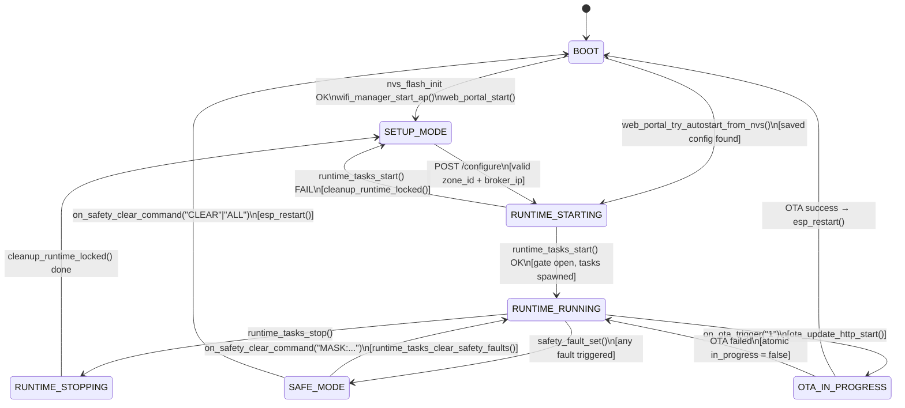

---

## 2. Wi-Fi Manager FSM

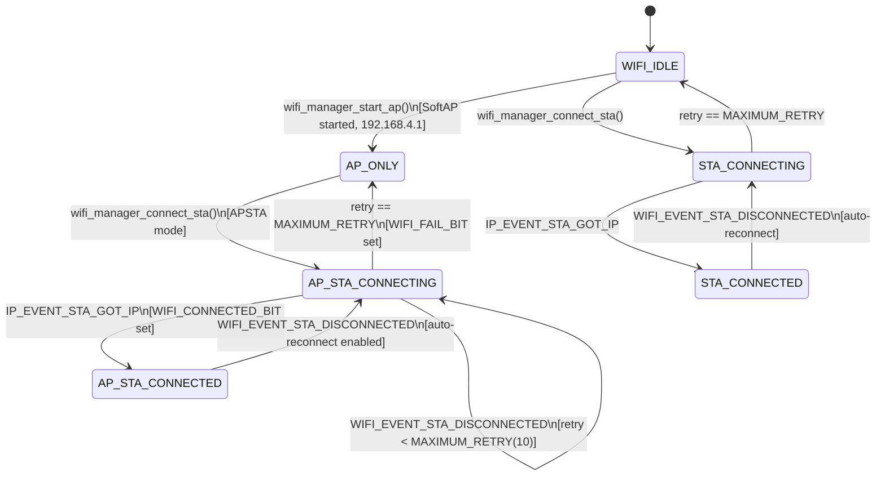

---

## 3. MQTT Manager FSM

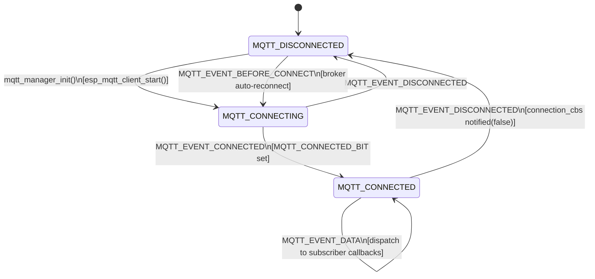

---

## 4. Runtime Tasks FSM (Worker Tasks Lifecycle)

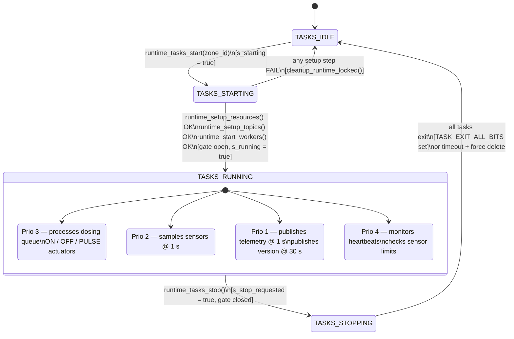

---

## 5. Dosing Task FSM (per command)

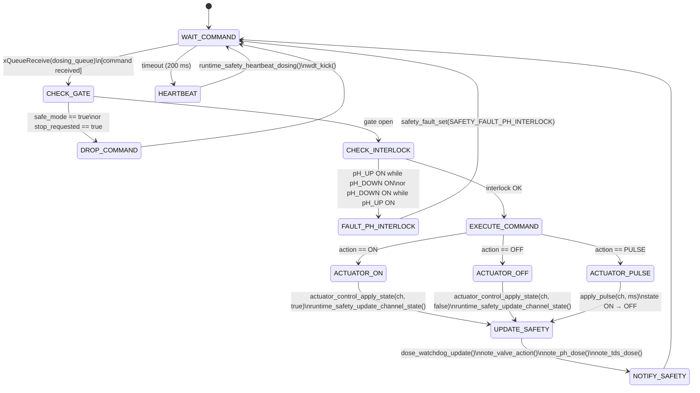

---

## 6. Safety Task FSM

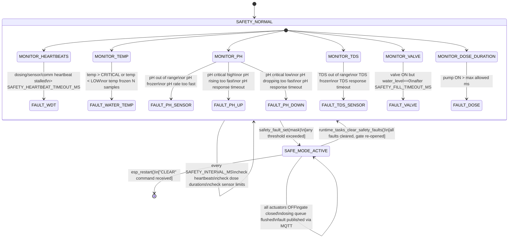

---

## 7. OTA Update FSM

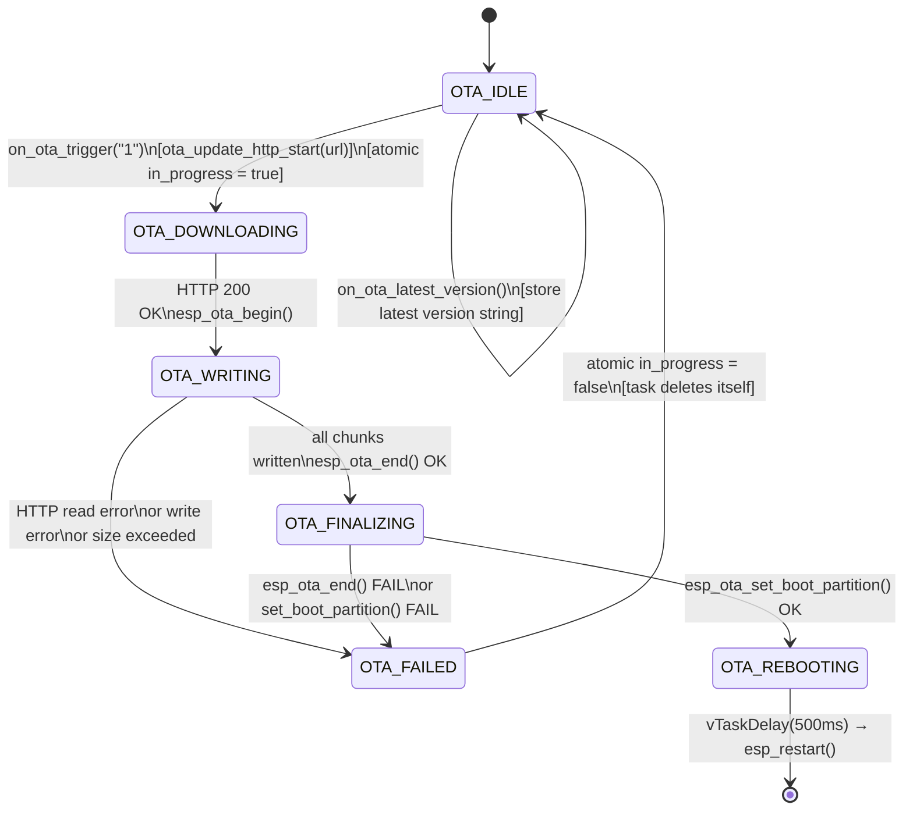

---

## 8. Valve Debounce FSM

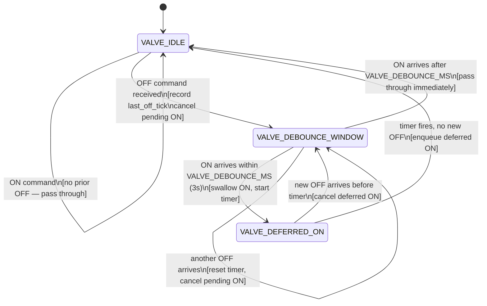

---

## 9. Boot Fault FSM

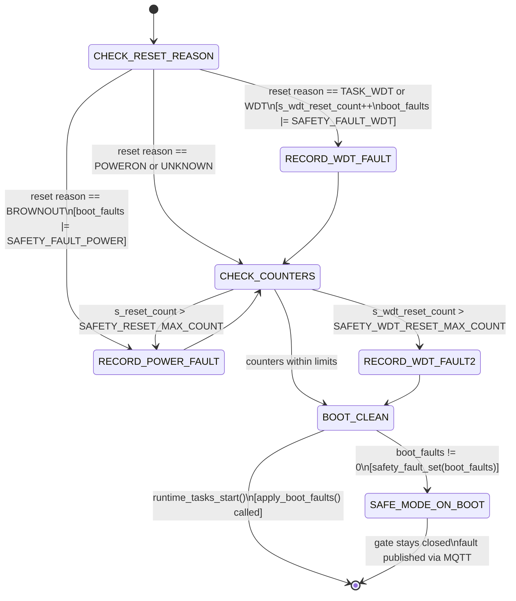

---

## 10. DosingTask — Core Loop FSM

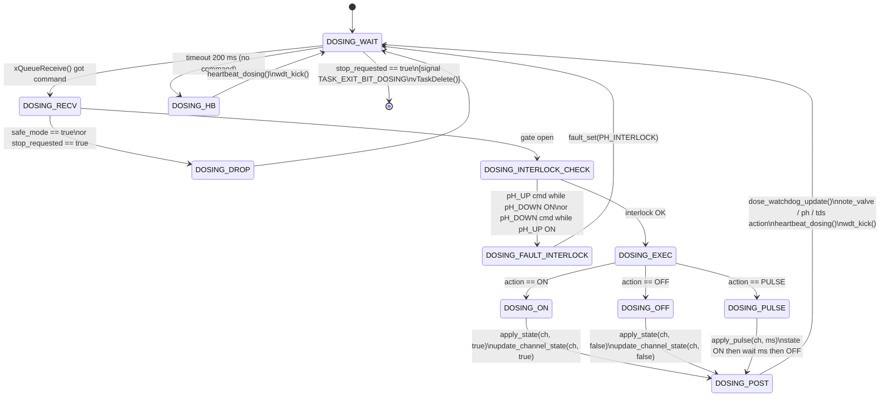

---

## 11. SensorTask — Core Loop FSM

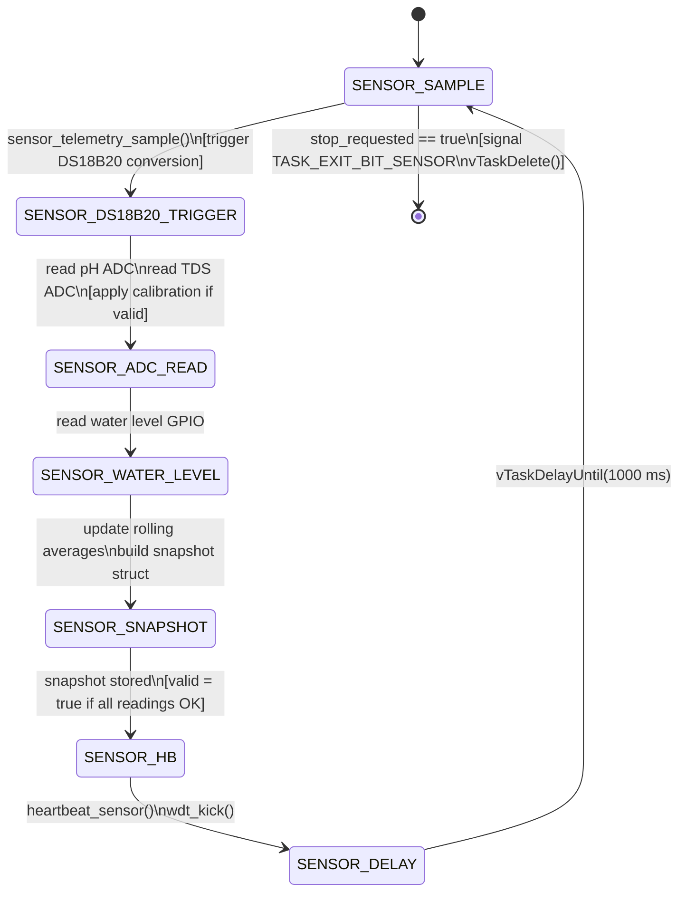

---

## 12. CommTask — Core Loop FSM

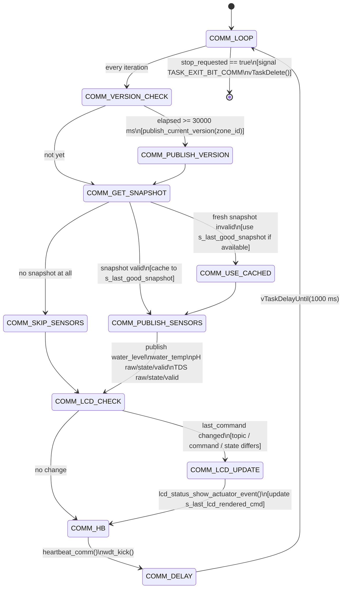

---

## 13. SafetyTask — Core Loop FSM

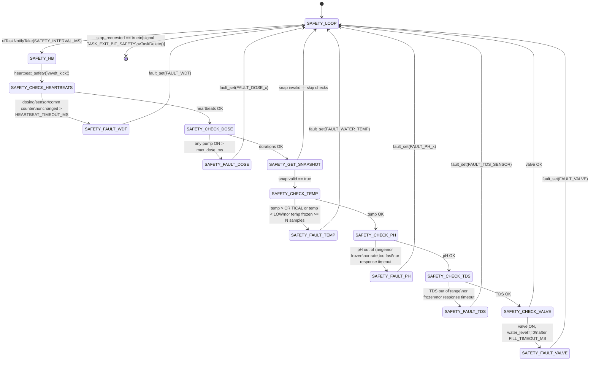
